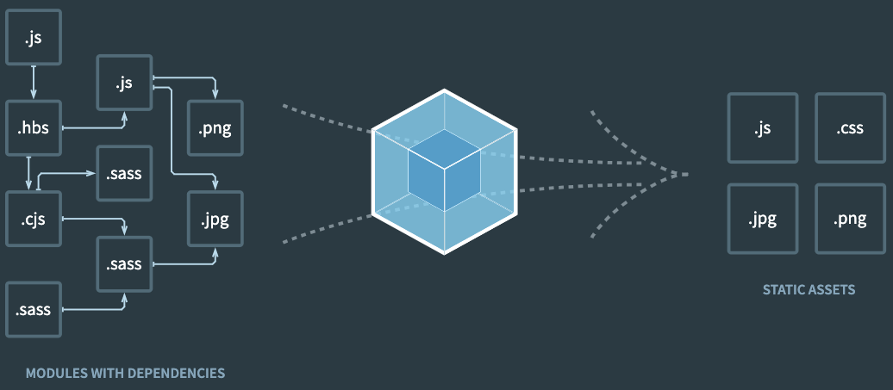

# webpack 入门

下方实践代码可从[https://github.com/xuwenchao66/webpack-practice](https://github.com/xuwenchao66/webpack-practice)查阅。

## webpack 是什么

打开 webpack 官网[https://webpack.js.org/](https://webpack.js.org/)，首先引入眼帘的就是下方的 banner。



这张图很形象的描述了什么是 webpack，图的右方有我们常见的文件如 js、png、sass 等，MODULES WITH DEPENDENCIES 字样，在 webpack 中所有文件皆为模块，而且模块之间有清晰的依赖关系，
这些带有依赖关系的模块文件经过 webpack 处理之后就会生成对应 STATIC ASSETS（静态资源）。

简单来说 webpack 就是一个静态资源打包器。

## webpack 核心概念

### [Entry](https://webpack.js.org/concepts/#entry)

入口模块，用于告诉 webpack 哪个模块、文件用来开始构建其内部[dependency graph](https://webpack.js.org/concepts/dependency-graph/)（依赖图），webpack 会找出该模块有哪些直接、间接的依赖。

### [Output](https://webpack.js.org/concepts/#output)

output 告诉 webpack 应该把其构建生成的 bundles 输出在哪，以及如何命名这些文件。

### [Loaders](https://webpack.js.org/concepts/#loaders)

webpack 默认只能识别 JavaScript 以及 JSON 文件，loaders 让 webpack 能够处理其它类型的文件，将它们转化为 webpack 可识别的模块。比如要处理 css 文件，就要添加对应的 css-loader。

### [Plugins](https://webpack.js.org/concepts/#plugins)

插件能够扩展 webpack 的能力，执行更多不同的任务，比如构建优化、注入环境变量等。

## webpack 入门使用

### 项目初始化

使用`npm init`初始化一个 npm 项目，因为 webpack 的默认 entry 为 `/src/index.js`，所以新建 `src` 目录，在该目录新建 `index.js` 作为入口模块，文件内容如下。

```js
document.body.innerHTML = 'Hello webpack.'
```

### 安装 webpack 相关依赖

```sh
npm install webpack webpack-cli --save-dev
```

### 添加 npm scripts

为了方便管理、使用，将构建命令添加至 `npm scripts`。

```json
"scripts": {
  "build": "webpack"
}
```

此时执行`npm run build`，构建成功，并且目录中多出了`./dist/main.js`文件，这是 webpack 的默认 `output` 值，`main.js` 就是构建出来的 bundle。

### 使用配置文件

webpack cli 可以支持传递参数，但是真实项目中的构建配置往往更加复杂，所以 webpack 也支持使用更加高效、易读的配置文件。

为了让本系列博客的代码更好地进行分类，所以将此次实践的代码都改为放在 `basic` 目录中，修改 `src` 文件夹名为 `basic`。

在 `basic` 目录中新建 webpack 配置文件 `webpack.config.js`，配置内容如下。

```js
const path = require('path')

module.exports = {
  entry: './basic/index.js',
  output: {
    filename: 'main.js',
    path: path.resolve(process.cwd(), 'basic/dist')
  }
}
```

- entry：指定入口文件为`./basic/index.js`。
- output.filename：输出的 bundle 文件名。
- output.path：输出 bundle 的目录的绝对路径。

这时候修改 `npm scripts`。

```json
"scripts": {
  "build": "webpack --config basic/webpack.config.js"
},
```

- --config：用于指定 webpack 读取的配置文件。

再次执行`npm run build`，构建成功，配置文件生效，在 `./basic/dist` 目录中生成构建生成的 bundle 文件 `main.js`。

## 参考

1. [webpack](https://webpack.js.org/)
2. [webpack concepts](https://webpack.js.org/concepts/)
3. [webpack getting started](https://webpack.js.org/guides/getting-started/)
