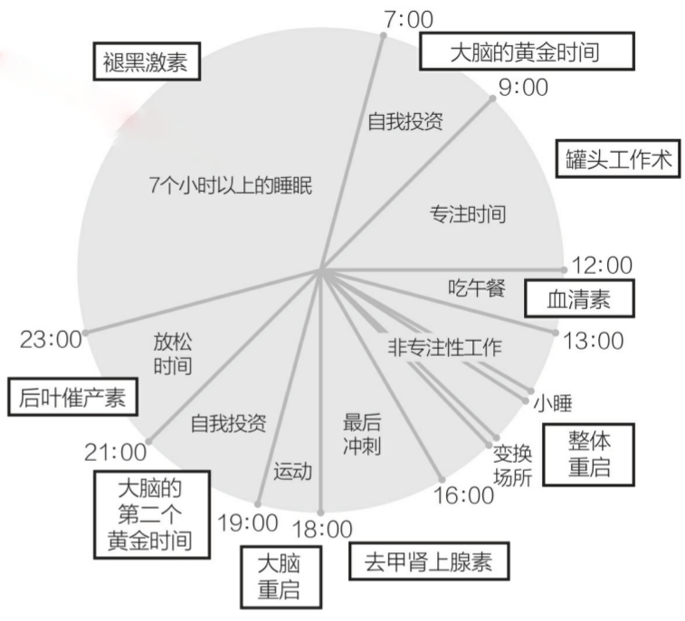

# 为什么精英都是时间控

1. 二维时间管理术（专注力 x 时间）

   做事情不应该只想到花多少时间，工作量 = 专注力（工作效率）x 时间，所以专注力也是尤为重要的。

2. 把握好工作的节奏，疲劳前休息

   疲劳会降低专注力，工作效率，应该在疲劳之前适度休息，保证专注力。

3. 提高专注力的特效药是"睡眠"，保证每天有 6 小时的睡眠

   充足的睡眠保证专注力。

4. 无论工作还是学习，以 45 分钟为一个时间单位，适度休息，可以让我们的专注持续时间更长

   这个 45 分钟只是一个例子，可自行调整，同第二点，人的持续专注力是有限的，应该在专注力下降之前适度休息。平时写代码遇到 bug，有时候会一直耗在那死磕，越磕越走不出来，这时候出去走走休息下，反倒想出问题所在了。适度休息，保持头脑清晰真的很重要。

5. 将“杂念”写下来，为大脑减负

   无论工作还是生活，很多时候我们都会“并发”接受任务，但很遗憾我们并不能够“并发”地做多件需要专注的事情，这样我们在做一项工作的时候往往心存杂念，想着其它需要处理的事情，这样会降低做事情的专注度。无论是待办任务还是心事，“写出来，然后就忘记”，等到完成一项任务的时候再去看看接下来需要完成的任务。

6. 早晨接收多余的垃圾信息，会打乱黄金时间，让专注力荡然无存

   就个人来说，在早上的“休闲”时间，喜欢到刷下知乎和朋友圈，也就是一些碎片没啥营养的东西 😳。这样一大早“整洁干净的大脑”就会充满了许多冗余信息，这种状态下很难维持高度专注。

7. 把握早上上班前珍贵的两小时“自我投资时间”

   早晨是精力最旺盛以及专注力最为集中的一个时间段，而且在工作未开始的时候，不会有人来打扰你，所以是最好的“自我投资时间”。提前起床便是获得这个时间的有效方法。

8. 事先做好 TODO 清单，就不用了浪费时间和精力去想“接下来我该做什么”

   当我们收到任务的时候，都会立刻在脑袋中思考这事情该怎么做等等，我们会将多个任务的思考“存储”这些待办事项。这么做一来会影响我们的专注力，二当我们需要拾起任务的时候往往需要花时间再想想“接下来要做啥，要怎么做”，这样就无形中影响了工作效率，所以将“要做什么，怎么做”写在 TODO 清单中，当做完一项任务的时候，瞥一眼清单就能够顺利开展下一项工作了。

9. 拉开窗帘睡觉，睡醒后睁眼五分钟。

   早起是个大事，睡懒觉是我们的天敌，养成习惯很重要，但要怎样养成这个习惯呢？书中介绍到打开窗帘睡觉，当阳光照在我们身上的时候，可以促进我们的脑内分泌血清素，血清素能够控制我们睡眠和清醒。当我阳光进入我们的视网膜，就会刺激血清素开始合成，有效帮助清醒。

10. 闭上眼睛就可以让脑力恢复

    工作中总会有那么一刻感觉疲惫，这时候可以闭上眼睛，小憩一会。只要闭上眼镜，就可以阻断视觉信息的输入，让大脑进入休息模式。

11. 战略性“后有约定”工作术

    其实就是限制自己的工作时间，比如今晚下班后有约，这样为了准时赴约我们在今天工作时候都会更加专注，拼命工作。不然就容易产生惰性，想着“今天干不完，那就加班干吧”，有这种想法不仅降低了工作效率还减少了自我投资时间。实在没人约的话，那就自己约自己吧 😳。

12. 不让压力和疲惫过夜

    在工作和生活中难免遇到烦心事，让人疲惫，这些事情能不带到第二天就不带，必须在今天处理完。因为这些事情造成的精神压力，会影响我们第二天状态。

13. 睡前 15 分钟是“记忆黄金时间”

    这个从小听到大了，有啥需要记忆的任务，就好好把握下这个时间。

14. 睡前 15 分钟不要向大脑输入多余信息，“睡前想什么，你就会变成什么样和的人”，不要想痛苦的事情，尽量多想些积极向上的事情。

    睡前思考的事情很容易进入我们的潜意识，所以多想想好的事情。

15. 规律的重要，与其周末补觉，不如保证平时足够的睡眠

    书中有实验证明，工作日睡眠不足，然后周末补觉，这样大脑机能也难以恢复，每天保证充足睡眠是最好的。

16. 每天按计划规律的做同样的事

    规律，习惯能将大脑机能发挥到最大。

17. 能现在做的事就现在做

    我们要迅速判断这个事情是否能马上完成，可以就现在做，不行就放在 TODO 清单里面。因为当我们再重启一项任务的时候需要花时间，比如回复一封邮件，我们需要再次打开浏览器，找到邮件，再看一遍等等。

18. 不是“到什么时间为止”而是“什么时间做”

    我们往往会给一项任务设定一个 deadline，这样很多时候在 deadline 到来的时候都没有完成任务。当然 deadline 很重要，但“什么时间开始做”也同样重要，这样我们不会老想着将任务推迟到 deadline 之前。

19. 设定合适的目标

    有目标的工作学习，能带来我们压力，而适度的压力有助于专注力的提高。而且将要做的事情写出来，然后一项项的完成，这种感觉真的很好啊。

20. 读书（做事情）一定要有输出

    这个还是体验比较深的，很多看过的书都忘了讲啥，到后来就跟没看过一样，什么都没留下来。以前刚开始写代码的时候也是，一开始就看书，后面发现实践的时候更多是捉襟见肘，后面边看边实践才开始有所好转。输入输出，在输出的时候思考，强化输入非常重要。

21. 想想自己的专长什么，并投资自己的主要专长

    每样都会一点，就是什么都不会，找到自己的长处特点，让自己不容易被替代才更容易立足社会之中。

22. 创造时间投资自己，提高工作能力，同时也提高工作效率，从而创造出更多的时间，进入一种良性循环

    自我投资 <=> 加速成长

23. 读书（主动娱乐）可以锻炼专注力，被动娱乐，分散专注力

    多读书

24. 享受现在的人才能获得幸福，马上做会让自己快乐的事情，人生就是有由一个个瞬间组成，增加快乐的瞬间

    上次想着要去蹦极，当天看天气有点阴沉沉的，然后心里又有一点点慌，有那么一刻想着就算了。最后还是出发了，当我做完这个事情的时候才发现这有多快乐。对啊，做快乐的事就不要犹豫太多了，现在就做，让自己更加快乐。

最后附上书一张图：根据脑科学设计的完美一天。

